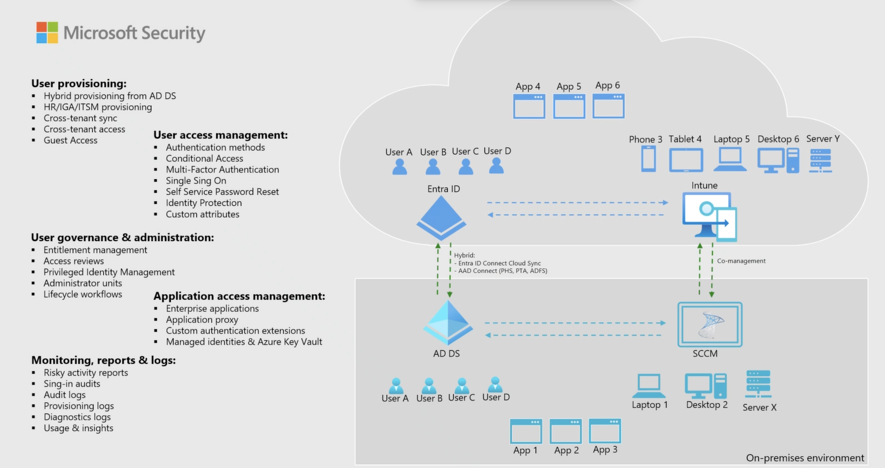
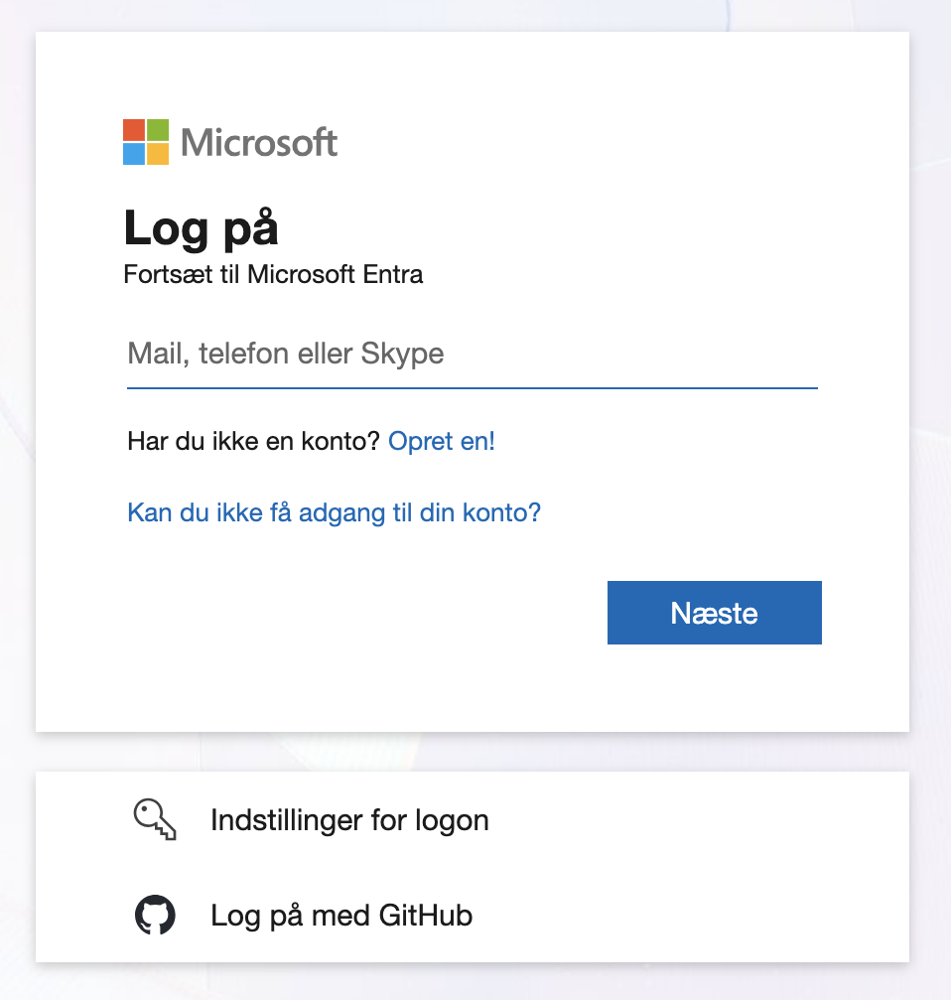

# M365-Security Portfolio

## Contents:

### Entra ID
Typical infrastructure architecture for medium-size enterprise companies.

### Scenario 1. Invite a Guest User to Microsoft Entra ID
Step 1: 
- Sign into Microsoft Entra Admin Center. Go to: https://entra.microsoft.com

- Sign in with a Global Administrator or User Administrator account.

Step 2: Invite the Guest User

- Navigate to Identity > Users > All users

- Click + Invite exteernal user

- Choose:

Invite user

- Fill out the form:

Name: (Optional, can be inferred from email)

Email address: example@example.com

(Optional) Add a personal message

- Click Invite

- The user will receive an email invitation. Once they accept, a B2B guest account is created in your directory.

### Microsoft Defender for Endpoint
### Microsoft Defender for Office 365

